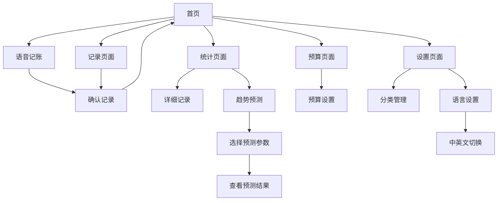

# 记个大概 - 产品需求文档

## 1. Product Overview
"记个大概"是一款专注于简化记账体验的个人财务管理Web应用。通过AI语音识别技术，用户只需说出"今天吃饭用了多少钱"等自然语言，系统即可自动识别金额并智能分类记录。
- 解决传统记账应用操作繁琐、分类复杂的痛点，让记账变得轻松自然，适合忙碌的现代人群快速记录日常开支。
- 目标是成为最简单易用的个人记账工具，帮助用户养成良好的财务记录习惯。

## 2. Core Features

### 2.1 Feature Module
我们的记账应用包含以下核心页面：
1. **首页**：语音记账入口、最近记录、本周/月支出概览
2. **记录页面**：手动记账、分类选择、金额输入
3. **统计页面**：支出分析、分类统计、趋势图表、支出趋势预测
4. **预算页面**：周预算设置、月预算设置、预算进度
5. **设置页面**：分类管理、语音设置、数据导出、语言切换
6. **国际化支持**：中英文双语界面，语言设置持久化
7. **趋势预测模块**：基于历史数据的支出趋势预测和分析

### 2.2 Page Details

| Page Name | Module Name | Feature description |
|-----------|-------------|---------------------|
| 首页 | 语音记账区域 | 点击录音按钮，识别语音内容，自动提取金额和分类，一键确认记录 |
| 首页 | 快速概览 | 显示今日、本周、本月支出总额，最近5条记录列表 |
| 首页 | 预算提醒 | 显示周/月预算使用进度，超支预警提示 |
| 记录页面 | 手动记账 | 金额输入、分类选择、备注添加、日期选择 |
| 记录页面 | 智能分类 | 基于历史记录和关键词自动推荐分类 |
| 统计页面 | 支出分析 | 按日/周/月查看支出趋势，饼图显示分类占比 |
| 统计页面 | 详细记录 | 支出记录列表，支持按分类和时间筛选 |
| 统计页面 | 趋势预测 | 基于历史数据预测未来支出趋势，支持按分类和时间周期预测 |
| 趋势预测模块 | 预测算法 | 使用线性回归和移动平均算法分析历史数据，生成预测结果 |
| 趋势预测模块 | 预测展示 | 图表可视化显示预测趋势，包含置信区间和预测准确度 |
| 趋势预测模块 | 交互控制 | 用户可选择预测时间范围（1-6个月）和特定分类进行预测 |
| 预算页面 | 预算设置 | 设置周预算和月预算金额，分类预算分配 |
| 预算页面 | 进度跟踪 | 实时显示预算使用情况，剩余金额提醒 |
| 设置页面 | 分类管理 | 添加、编辑、删除支出分类，设置分类图标 |
| 设置页面 | 数据管理 | 数据备份、导出Excel、清空数据 |
| 设置页面 | 语言设置 | 中英文语言切换，语言偏好保存到本地存储 |
| 国际化模块 | 多语言支持 | 所有界面文本支持中英文切换，包括按钮、标签、提示信息 |
| 国际化模块 | 语言检测 | 根据浏览器语言自动设置默认语言，支持手动切换 |

## 3. Core Process

**主要用户操作流程：**

1. **语音记账流程**：用户进入首页 → 点击语音记账按钮 → 说出支出内容 → 系统识别并显示解析结果 → 用户确认或修改 → 保存记录

2. **手动记账流程**：用户进入记录页面 → 输入金额 → 选择分类 → 添加备注（可选）→ 选择日期 → 保存记录

3. **查看统计流程**：用户进入统计页面 → 选择时间范围 → 查看支出趋势和分类分析 → 点击详细记录查看具体条目

4. **预算管理流程**：用户进入预算页面 → 设置周/月预算 → 系统实时跟踪支出 → 接近或超出预算时提醒用户

5. **语言切换流程**：用户进入设置页面 → 点击语言设置 → 选择中文或英文 → 系统立即切换界面语言 → 语言偏好自动保存

6. **趋势预测流程**：用户进入统计页面 → 点击趋势预测标签 → 选择预测时间范围和分类 → 系统分析历史数据 → 显示预测图表和趋势分析 → 用户查看预测结果和建议

## 4. User Interface Design

### 4.1 Design Style
- **主色调**：清新绿色 (#4CAF50) 作为主色，浅灰色 (#F5F5F5) 作为背景色
- **按钮样式**：圆角按钮设计，主要按钮使用渐变效果，次要按钮使用线框样式
- **字体**：系统默认字体，标题使用 18px，正文使用 14px，小字使用 12px
- **布局风格**：卡片式布局，顶部导航栏，底部Tab导航
- **图标风格**：使用简洁的线性图标，支持分类图标自定义

### 4.2 Page Design Overview

| Page Name | Module Name | UI Elements |
|-----------|-------------|-------------|
| 首页 | 语音记账区域 | 大圆形录音按钮(绿色渐变)，波形动画效果，白色卡片背景 |
| 首页 | 快速概览 | 三个并排的数据卡片，显示今日/本周/本月支出，使用不同深浅的绿色 |
| 首页 | 最近记录 | 列表样式，每条记录显示分类图标、描述、金额和时间 |
| 记录页面 | 金额输入 | 大号数字键盘，金额显示区域使用大字体，绿色强调 |
| 记录页面 | 分类选择 | 网格布局的分类图标，选中状态有绿色边框和背景 |
| 统计页面 | 图表区域 | 饼图和折线图，使用绿色系配色方案，支持交互点击 |
| 统计页面 | 趋势预测区域 | 预测图表使用虚线表示预测数据，实线表示历史数据，置信区间用半透明绿色填充 |
| 趋势预测模块 | 参数选择器 | 时间范围滑块和分类下拉选择器，绿色主题，清晰的标签说明 |
| 趋势预测模块 | 预测结果卡片 | 显示预测金额、增长趋势、准确度指标，使用卡片布局和图标提示 |
| 预算页面 | 进度条 | 圆形进度条显示预算使用情况，绿色表示正常，橙色警告，红色超支 |
| 设置页面 | 设置项 | 列表样式，每项有图标、标题和右箭头，分组显示 |
| 设置页面 | 语言切换 | 语言选择器，显示当前语言，点击弹出中英文选项，选中项有绿色标识 |

### 4.3 Responsiveness
应用采用移动优先的响应式设计，主要针对手机端优化，同时兼容平板和桌面端。支持触摸手势操作，如滑动删除记录、长按编辑等交互方式。

## 5. 国际化功能详细需求

### 5.1 支持语言
- **中文（简体）**：默认语言，zh-CN
- **英文**：English，en-US

### 5.2 功能要求
- **语言切换**：在设置页面提供语言选择器，支持实时切换
- **持久化存储**：用户选择的语言偏好保存到localStorage
- **自动检测**：首次访问时根据浏览器语言自动设置默认语言
- **全局生效**：语言切换后所有页面立即生效，无需刷新

### 5.3 翻译范围
- **界面文本**：所有按钮、标签、标题、提示信息
- **分类名称**：支出分类的中英文对照
- **错误信息**：表单验证和系统错误提示
- **日期格式**：根据语言调整日期显示格式
- **数字格式**：货币符号和数字分隔符本地化

### 5.4 技术实现
- **国际化框架**：使用Vue I18n进行多语言管理
- **语言文件**：创建zh-CN.json和en-US.json语言包
- **动态加载**：支持语言包的懒加载以优化性能
- **回退机制**：缺失翻译时回退到默认语言（中文）

## 6. 支出趋势预测功能详细需求

### 6.1 功能概述
支出趋势预测功能基于用户的历史支出数据，使用统计学算法预测未来的支出趋势，帮助用户更好地规划财务和制定预算。

### 6.2 数据要求
- **最少数据量**：至少需要3个月的历史支出数据才能进行有效预测
- **数据质量**：需要有足够的数据点，建议每月至少10条支出记录
- **数据完整性**：支出记录需包含金额、分类、日期等完整信息

### 6.3 预测算法
- **线性回归**：分析支出金额随时间的线性变化趋势
- **移动平均**：计算不同时间窗口的平均支出，平滑数据波动
- **季节性分析**：识别支出的季节性模式（如节假日消费增加）
- **分类预测**：针对不同支出分类分别进行趋势预测

### 6.4 预测维度
- **时间维度**：支持按周、月、季度进行预测
- **分类维度**：可选择全部分类或特定分类进行预测
- **预测范围**：支持预测未来1-6个月的支出趋势
- **置信度**：提供预测结果的置信区间和准确度评估

### 6.5 用户交互
- **参数选择**：用户可选择预测时间范围、分类、预测周期
- **图表展示**：使用折线图显示历史数据和预测趋势
- **数据对比**：可对比不同时间段或分类的预测结果
- **预测建议**：基于预测结果提供财务建议和预算建议

### 6.6 预测准确性
- **历史验证**：使用历史数据验证预测算法的准确性
- **误差分析**：计算预测误差并显示给用户
- **模型优化**：根据用户反馈和实际数据持续优化预测模型
- **异常检测**：识别异常支出数据，避免影响预测准确性

### 6.7 界面设计要求
- **预测图表**：使用虚线表示预测数据，实线表示历史数据
- **置信区间**：用半透明色彩填充表示预测的不确定性范围
- **交互控件**：提供时间范围滑块、分类选择器等交互元素
- **结果展示**：以卡片形式展示关键预测指标和趋势分析
- **响应式设计**：确保在不同设备上都有良好的显示效果