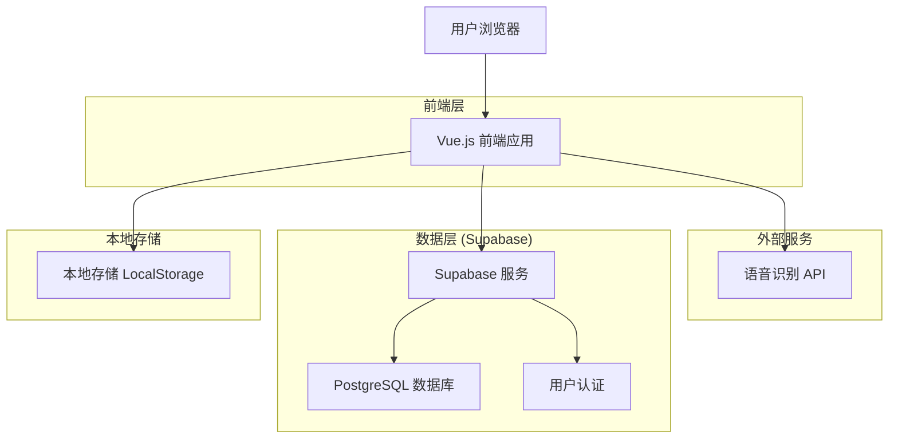
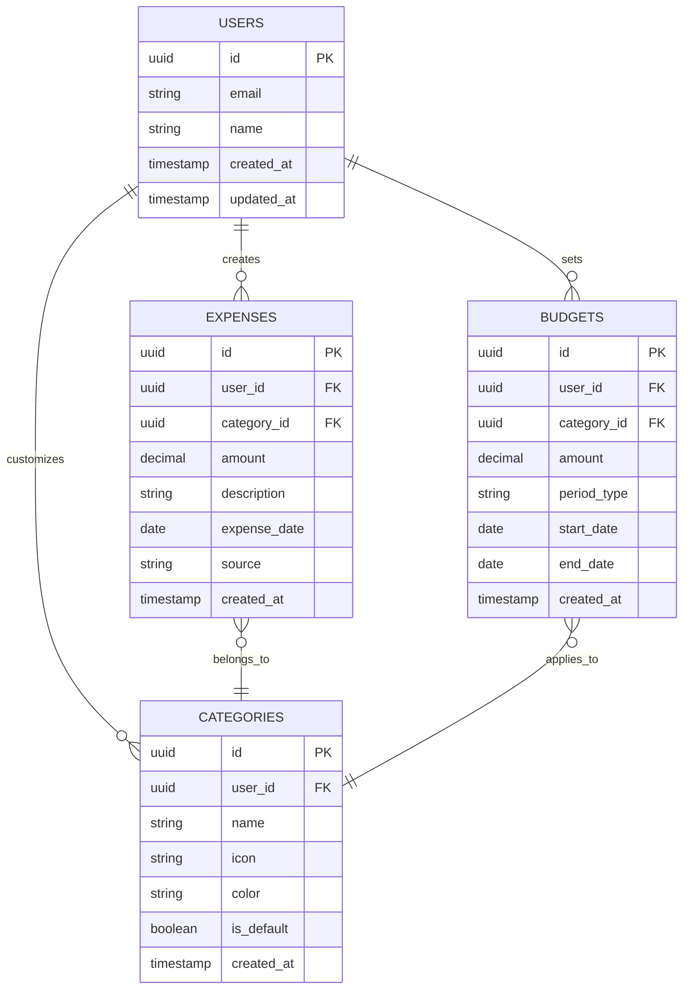

# 记个大概 - 技术架构文档

## 1. Architecture design



## 2. Technology Description

* **前端**: Vue.js\@3 + Vite + Tailwind CSS + Pinia

* **后端**: Supabase (提供数据库、认证、实时同步)

* **语音识别**: Web Speech API (浏览器原生) + 百度语音识别API (备选)

* **图表库**: Chart.js

* **UI组件**: 自定义组件 + Headless UI

## 3. Route definitions

| Route       | Purpose          |
| ----------- | ---------------- |
| /           | 首页，显示语音记账入口和支出概览 |
| /record     | 手动记账页面，金额输入和分类选择 |
| /statistics | 统计分析页面，支出趋势和分类统计 |
| /budget     | 预算管理页面，设置和跟踪预算   |
| /settings   | 设置页面，分类管理和数据导出   |
| /login      | 登录页面，用户认证        |

## 4. API definitions

### 4.1 Core API

**语音识别相关**

```
POST /api/speech/recognize
```

Request:

| Param Name  | Param Type | isRequired | Description     |
| ----------- | ---------- | ---------- | --------------- |
| audio\_data | blob       | true       | 录音数据            |
| format      | string     | true       | 音频格式 (webm/wav) |

Response:

| Param Name | Param Type | Description |
| ---------- | ---------- | ----------- |
| text       | string     | 识别出的文字内容    |
| amount     | number     | 提取的金额       |
| category   | string     | 推测的分类       |
| confidence | number     | 识别置信度       |

Example:

```json
{
  "text": "今天吃饭用了50块钱",
  "amount": 50,
  "category": "餐饮",
  "confidence": 0.95
}
```

**支出记录相关**

```
POST /api/expenses
GET /api/expenses
PUT /api/expenses/:id
DELETE /api/expenses/:id
```

**预算管理相关**

```
POST /api/budgets
GET /api/budgets
PUT /api/budgets/:id
```

## 5. Data model

### 5.1 Data model definition



### 5.2 Data Definition Language

**用户表 (users)**

```sql
-- Supabase Auth 自动管理用户表，无需手动创建
```

**支出记录表 (expenses)**

```sql
CREATE TABLE expenses (
    id UUID PRIMARY KEY DEFAULT gen_random_uuid(),
    user_id UUID REFERENCES auth.users(id) ON DELETE CASCADE,
    category_id UUID REFERENCES categories(id),
    amount DECIMAL(10,2) NOT NULL,
    description TEXT,
    expense_date DATE NOT NULL DEFAULT CURRENT_DATE,
    source VARCHAR(20) DEFAULT 'manual' CHECK (source IN ('manual', 'voice')),
    created_at TIMESTAMP WITH TIME ZONE DEFAULT NOW()
);

-- 创建索引
CREATE INDEX idx_expenses_user_id ON expenses(user_id);
CREATE INDEX idx_expenses_date ON expenses(expense_date DESC);
CREATE INDEX idx_expenses_category ON expenses(category_id);

-- 权限设置
GRANT SELECT ON expenses TO anon;
GRANT ALL PRIVILEGES ON expenses TO authenticated;
```

**分类表 (categories)**

```sql
CREATE TABLE categories (
    id UUID PRIMARY KEY DEFAULT gen_random_uuid(),
    user_id UUID REFERENCES auth.users(id) ON DELETE CASCADE,
    name VARCHAR(50) NOT NULL,
    icon VARCHAR(50) DEFAULT '💰',
    color VARCHAR(7) DEFAULT '#4CAF50',
    is_default BOOLEAN DEFAULT false,
    created_at TIMESTAMP WITH TIME ZONE DEFAULT NOW()
);

-- 创建索引
CREATE INDEX idx_categories_user_id ON categories(user_id);

-- 权限设置
GRANT SELECT ON categories TO anon;
GRANT ALL PRIVILEGES ON categories TO authenticated;

-- 初始化默认分类
INSERT INTO categories (name, icon, color, is_default) VALUES
('餐饮', '🍽️', '#FF9800', true),
('交通', '🚗', '#2196F3', true),
('购物', '🛒', '#E91E63', true),
('娱乐', '🎬', '#9C27B0', true),
('医疗', '🏥', '#F44336', true),
('教育', '📚', '#3F51B5', true),
('其他', '💰', '#607D8B', true);
```

**预算表 (budgets)**

```sql
CREATE TABLE budgets (
    id UUID PRIMARY KEY DEFAULT gen_random_uuid(),
    user_id UUID REFERENCES auth.users(id) ON DELETE CASCADE,
    category_id UUID REFERENCES categories(id),
    amount DECIMAL(10,2) NOT NULL,
    period_type VARCHAR(10) NOT NULL CHECK (period_type IN ('weekly', 'monthly')),
    start_date DATE NOT NULL,
    end_date DATE NOT NULL,
    created_at TIMESTAMP WITH TIME ZONE DEFAULT NOW()
);

-- 创建索引
CREATE INDEX idx_budgets_user_id ON budgets(user_id);
CREATE INDEX idx_budgets_period ON budgets(start_date, end_date);

-- 权限设置
GRANT SELECT ON budgets TO anon;
GRAN
```

