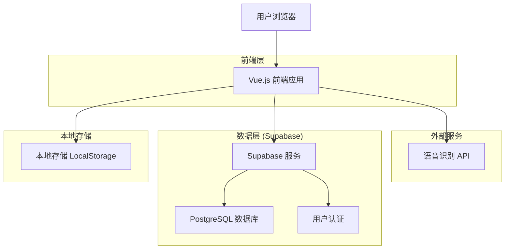
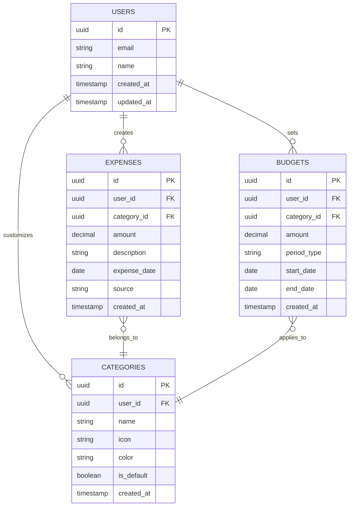
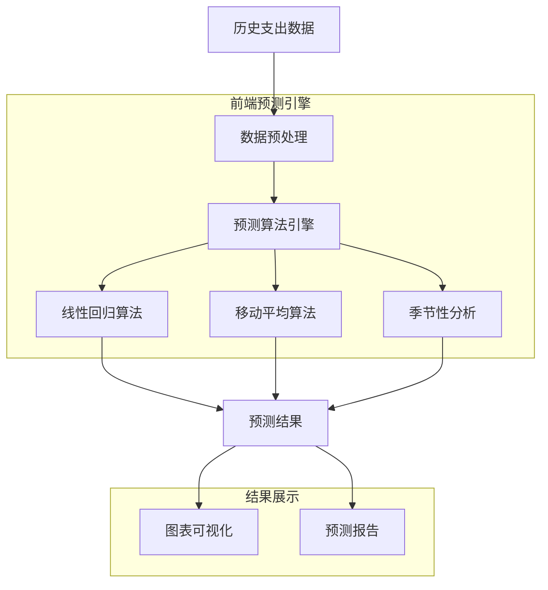

# 记个大概 - 技术架构文档

## 1. Architecture design



## 2. Technology Description

* **前端**: Vue.js\@3 + Vite + Tailwind CSS + Pinia + Vue I18n

* **后端**: Supabase (提供数据库、认证、实时同步)

* **语音识别**: Web Speech API (浏览器原生) + 百度语音识别API (备选)

* **图表库**: Chart.js + 趋势预测图表组件

* **数据分析**: 前端JavaScript实现线性回归和移动平均算法

* **UI组件**: 自定义组件 + Headless UI

* **国际化**: Vue I18n + 本地存储语言偏好

## 3. Route definitions

| Route       | Purpose          |
| ----------- | ---------------- |
| /           | 首页，显示语音记账入口和支出概览 |
| /record     | 手动记账页面，金额输入和分类选择 |
| /statistics | 统计分析页面，支出趋势和分类统计 |
| /budget     | 预算管理页面，设置和跟踪预算   |
| /settings   | 设置页面，分类管理和数据导出   |
| /login      | 登录页面，用户认证        |

## 4. API definitions

### 4.1 Core API

**语音识别相关**

```
POST /api/speech/recognize
```

Request:

| Param Name  | Param Type | isRequired | Description     |
| ----------- | ---------- | ---------- | --------------- |
| audio\_data | blob       | true       | 录音数据            |
| format      | string     | true       | 音频格式 (webm/wav) |

Response:

| Param Name | Param Type | Description |
| ---------- | ---------- | ----------- |
| text       | string     | 识别出的文字内容    |
| amount     | number     | 提取的金额       |
| category   | string     | 推测的分类       |
| confidence | number     | 识别置信度       |

Example:

```json
{
  "text": "今天吃饭用了50块钱",
  "amount": 50,
  "category": "餐饮",
  "confidence": 0.95
}
```

**支出记录相关**

```
POST /api/expenses
GET /api/expenses
PUT /api/expenses/:id
DELETE /api/expenses/:id
```

**预算管理相关**

```
POST /api/budgets
GET /api/budgets
PUT /api/budgets/:id
```

## 5. Data model

### 5.1 Data model definition



### 5.2 Data Definition Language

**用户表 (users)**

```sql
-- Supabase Auth 自动管理用户表，无需手动创建
```

**支出记录表 (expenses)**

```sql
CREATE TABLE expenses (
    id UUID PRIMARY KEY DEFAULT gen_random_uuid(),
    user_id UUID REFERENCES auth.users(id) ON DELETE CASCADE,
    category_id UUID REFERENCES categories(id),
    amount DECIMAL(10,2) NOT NULL,
    description TEXT,
    expense_date DATE NOT NULL DEFAULT CURRENT_DATE,
    source VARCHAR(20) DEFAULT 'manual' CHECK (source IN ('manual', 'voice')),
    created_at TIMESTAMP WITH TIME ZONE DEFAULT NOW()
);

-- 创建索引
CREATE INDEX idx_expenses_user_id ON expenses(user_id);
CREATE INDEX idx_expenses_date ON expenses(expense_date DESC);
CREATE INDEX idx_expenses_category ON expenses(category_id);

-- 权限设置
GRANT SELECT ON expenses TO anon;
GRANT ALL PRIVILEGES ON expenses TO authenticated;
```

**分类表 (categories)**

```sql
CREATE TABLE categories (
    id UUID PRIMARY KEY DEFAULT gen_random_uuid(),
    user_id UUID REFERENCES auth.users(id) ON DELETE CASCADE,
    name VARCHAR(50) NOT NULL,
    icon VARCHAR(50) DEFAULT '💰',
    color VARCHAR(7) DEFAULT '#4CAF50',
    is_default BOOLEAN DEFAULT false,
    created_at TIMESTAMP WITH TIME ZONE DEFAULT NOW()
);

-- 创建索引
CREATE INDEX idx_categories_user_id ON categories(user_id);

-- 权限设置
GRANT SELECT ON categories TO anon;
GRANT ALL PRIVILEGES ON categories TO authenticated;

-- 初始化默认分类
INSERT INTO categories (name, icon, color, is_default) VALUES
('餐饮', '🍽️', '#FF9800', true),
('交通', '🚗', '#2196F3', true),
('购物', '🛒', '#E91E63', true),
('娱乐', '🎬', '#9C27B0', true),
('医疗', '🏥', '#F44336', true),
('教育', '📚', '#3F51B5', true),
('其他', '💰', '#607D8B', true);
```

**预算表 (budgets)**

```sql
CREATE TABLE budgets (
    id UUID PRIMARY KEY DEFAULT gen_random_uuid(),
    user_id UUID REFERENCES auth.users(id) ON DELETE CASCADE,
    category_id UUID REFERENCES categories(id),
    amount DECIMAL(10,2) NOT NULL,
    period_type VARCHAR(10) NOT NULL CHECK (period_type IN ('weekly', 'monthly')),
    start_date DATE NOT NULL,
    end_date DATE NOT NULL,
    created_at TIMESTAMP WITH TIME ZONE DEFAULT NOW()
);

-- 创建索引
CREATE INDEX idx_budgets_user_id ON budgets(user_id);
CREATE INDEX idx_budgets_period ON budgets(start_date, end_date);

-- 权限设置
GRANT SELECT ON budgets TO anon;
GRANT ALL PRIVILEGES ON budgets TO authenticated;
```

## 6. 国际化技术实现

### 6.1 技术栈
- **Vue I18n**: Vue.js官方国际化插件
- **语言文件**: JSON格式的翻译文件
- **本地存储**: localStorage保存用户语言偏好

### 6.2 目录结构
```
src/
├── locales/
│   ├── zh-CN.json    # 中文语言包
│   ├── en-US.json    # 英文语言包
│   └── index.ts      # i18n配置文件
├── composables/
│   └── useI18n.ts    # 国际化组合式函数
└── components/
    └── LanguageSwitch.vue  # 语言切换组件
```

### 6.3 配置实现

**i18n配置 (src/locales/index.ts)**
```typescript
import { createI18n } from 'vue-i18n'
import zhCN from './zh-CN.json'
import enUS from './en-US.json'

const messages = {
  'zh-CN': zhCN,
  'en-US': enUS
}

// 获取浏览器语言或本地存储的语言偏好
const getDefaultLocale = () => {
  const saved = localStorage.getItem('locale')
  if (saved) return saved
  
  const browserLang = navigator.language
  return messages[browserLang] ? browserLang : 'zh-CN'
}

export const i18n = createI18n({
  legacy: false,
  locale: getDefaultLocale(),
  fallbackLocale: 'zh-CN',
  messages
})
```

### 6.4 语言文件结构

**中文语言包 (zh-CN.json)**
```json
{
  "common": {
    "confirm": "确认",
    "cancel": "取消",
    "save": "保存",
    "delete": "删除",
    "edit": "编辑"
  },
  "nav": {
    "home": "首页",
    "record": "记录",
    "statistics": "统计",
    "budget": "预算",
    "settings": "设置"
  },
  "categories": {
    "food": "餐饮",
    "transport": "交通",
    "shopping": "购物",
    "entertainment": "娱乐",
    "medical": "医疗",
    "education": "教育",
    "other": "其他"
  }
}
```

**英文语言包 (en-US.json)**
```json
{
  "common": {
    "confirm": "Confirm",
    "cancel": "Cancel",
    "save": "Save",
    "delete": "Delete",
    "edit": "Edit"
  },
  "nav": {
    "home": "Home",
    "record": "Record",
    "statistics": "Statistics",
    "budget": "Budget",
    "settings": "Settings"
  },
  "categories": {
    "food": "Food",
    "transport": "Transport",
    "shopping": "Shopping",
    "entertainment": "Entertainment",
    "medical": "Medical",
    "education": "Education",
    "other": "Other"
  }
}
```

### 6.5 组件使用示例

**在Vue组件中使用**
```vue
<template>
  <div>
    <h1>{{ $t('nav.home') }}</h1>
    <button>{{ $t('common.confirm') }}</button>
  </div>
</template>

<script setup>
import { useI18n } from 'vue-i18n'

const { t, locale } = useI18n()

// 切换语言
const switchLanguage = (lang: string) => {
  locale.value = lang
  localStorage.setItem('locale', lang)
}
</script>
```

### 6.6 语言切换组件

**LanguageSwitch.vue**
```vue
<template>
  <div class="language-switch">
    <select v-model="currentLocale" @change="handleLanguageChange">
      <option value="zh-CN">中文</option>
      <option value="en-US">English</option>
    </select>
  </div>
</template>

<script setup>
import { ref, watch } from 'vue'
import { useI18n } from 'vue-i18n'

const { locale } = useI18n()
const currentLocale = ref(locale.value)

const handleLanguageChange = () => {
  locale.value = currentLocale.value
  localStorage.setItem('locale', currentLocale.value)
}

watch(locale, (newLocale) => {
  currentLocale.value = newLocale
})
</script>
```

## 7. 支出趋势预测技术实现

### 7.1 技术架构



### 7.2 核心算法实现

**线性回归算法 (composables/useTrendPrediction.ts)**
```typescript
interface ExpenseData {
  date: string
  amount: number
  category: string
}

interface PredictionResult {
  predictedAmount: number
  trend: 'increasing' | 'decreasing' | 'stable'
  confidence: number
  dataPoints: Array<{ date: string; amount: number; isPredicted: boolean }>
}

export function useLinearRegression() {
  const calculateLinearRegression = (data: ExpenseData[]) => {
    const n = data.length
    if (n < 3) return null
    
    // 将日期转换为数值（天数）
    const baseDate = new Date(data[0].date).getTime()
    const points = data.map((item, index) => ({
      x: (new Date(item.date).getTime() - baseDate) / (1000 * 60 * 60 * 24),
      y: item.amount
    }))
    
    // 计算线性回归系数
    const sumX = points.reduce((sum, p) => sum + p.x, 0)
    const sumY = points.reduce((sum, p) => sum + p.y, 0)
    const sumXY = points.reduce((sum, p) => sum + p.x * p.y, 0)
    const sumXX = points.reduce((sum, p) => sum + p.x * p.x, 0)
    
    const slope = (n * sumXY - sumX * sumY) / (n * sumXX - sumX * sumX)
    const intercept = (sumY - slope * sumX) / n
    
    // 计算R²决定系数
    const meanY = sumY / n
    const ssTotal = points.reduce((sum, p) => sum + Math.pow(p.y - meanY, 2), 0)
    const ssRes = points.reduce((sum, p) => {
      const predicted = slope * p.x + intercept
      return sum + Math.pow(p.y - predicted, 2)
    }, 0)
    const rSquared = 1 - (ssRes / ssTotal)
    
    return { slope, intercept, confidence: rSquared }
  }
  
  return { calculateLinearRegression }
}
```

**移动平均算法**
```typescript
export function useMovingAverage() {
  const calculateMovingAverage = (data: ExpenseData[], windowSize: number = 7) => {
    if (data.length < windowSize) return []
    
    const result = []
    for (let i = windowSize - 1; i < data.length; i++) {
      const window = data.slice(i - windowSize + 1, i + 1)
      const average = window.reduce((sum, item) => sum + item.amount, 0) / windowSize
      result.push({
        date: data[i].date,
        amount: average
      })
    }
    
    return result
  }
  
  const predictNextPeriod = (movingAverages: Array<{date: string, amount: number}>, periods: number) => {
    if (movingAverages.length < 3) return []
    
    const recent = movingAverages.slice(-3)
    const trend = (recent[2].amount - recent[0].amount) / 2
    
    const predictions = []
    const lastDate = new Date(recent[recent.length - 1].date)
    
    for (let i = 1; i <= periods; i++) {
      const nextDate = new Date(lastDate)
      nextDate.setDate(lastDate.getDate() + i * 7) // 按周预测
      
      predictions.push({
        date: nextDate.toISOString().split('T')[0],
        amount: recent[recent.length - 1].amount + trend * i,
        isPredicted: true
      })
    }
    
    return predictions
  }
  
  return { calculateMovingAverage, predictNextPeriod }
}
```

### 7.3 预测组合函数

**主预测引擎 (composables/useTrendPrediction.ts)**
```typescript
export function useTrendPrediction() {
  const { calculateLinearRegression } = useLinearRegression()
  const { calculateMovingAverage, predictNextPeriod } = useMovingAverage()
  
  const generatePrediction = async (
    expenses: ExpenseData[],
    options: {
      category?: string
      predictionMonths: number
      algorithm: 'linear' | 'moving_average' | 'combined'
    }
  ): Promise<PredictionResult | null> => {
    // 数据预处理
    let filteredData = expenses
    if (options.category) {
      filteredData = expenses.filter(e => e.category === options.category)
    }
    
    // 按日期排序
    filteredData.sort((a, b) => new Date(a.date).getTime() - new Date(b.date).getTime())
    
    // 检查数据量是否足够
    if (filteredData.length < 30) { // 至少需要30条记录
      return null
    }
    
    let prediction: PredictionResult
    
    switch (options.algorithm) {
      case 'linear':
        prediction = await generateLinearPrediction(filteredData, options.predictionMonths)
        break
      case 'moving_average':
        prediction = await generateMovingAveragePrediction(filteredData, options.predictionMonths)
        break
      case 'combined':
        prediction = await generateCombinedPrediction(filteredData, options.predictionMonths)
        break
      default:
        prediction = await generateCombinedPrediction(filteredData, options.predictionMonths)
    }
    
    return prediction
  }
  
  return { generatePrediction }
}
```

### 7.4 图表可视化组件

**趋势预测图表组件 (components/TrendPredictionChart.vue)**
```vue
<template>
  <div class="trend-prediction-chart">
    <div class="chart-controls mb-4">
      <div class="flex gap-4">
        <select v-model="selectedCategory" class="form-select">
          <option value="">{{ $t('prediction.allCategories') }}</option>
          <option v-for="cat in categories" :key="cat.id" :value="cat.name">
            {{ $t(`categories.${cat.name}`) }}
          </option>
        </select>
        
        <input 
          v-model="predictionMonths" 
          type="range" 
          min="1" 
          max="6" 
          class="range-slider"
        >
        <span>{{ predictionMonths }}{{ $t('prediction.months') }}</span>
      </div>
    </div>
    
    <div class="chart-container">
      <canvas ref="chartCanvas"></canvas>
    </div>
    
    <div class="prediction-summary mt-4">
      <div class="grid grid-cols-3 gap-4">
        <div class="stat-card">
          <h3>{{ $t('prediction.nextMonthPrediction') }}</h3>
          <p class="text-2xl font-bold text-green-600">
            ¥{{ predictionResult?.predictedAmount?.toFixed(2) }}
          </p>
        </div>
        
        <div class="stat-card">
          <h3>{{ $t('prediction.trend') }}</h3>
          <p class="text-lg" :class="trendClass">
            {{ $t(`prediction.${predictionResult?.trend}`) }}
          </p>
        </div>
        
        <div class="stat-card">
          <h3>{{ $t('prediction.confidence') }}</h3>
          <p class="text-lg">
            {{ (predictionResult?.confidence * 100)?.toFixed(1) }}%
          </p>
        </div>
      </div>
    </div>
  </div>
</template>

<script setup>
import { ref, computed, watch, onMounted } from 'vue'
import { Chart, registerables } from 'chart.js'
import { useTrendPrediction } from '@/composables/useTrendPrediction'
import { useExpenseStore } from '@/stores/expense'

Chart.register(...registerables)

const expenseStore = useExpenseStore()
const { generatePrediction } = useTrendPrediction()

const chartCanvas = ref(null)
const selectedCategory = ref('')
const predictionMonths = ref(3)
const predictionResult = ref(null)
const chart = ref(null)

const categories = computed(() => expenseStore.categories)
const expenses = computed(() => expenseStore.expenses)

const trendClass = computed(() => {
  switch (predictionResult.value?.trend) {
    case 'increasing': return 'text-red-600'
    case 'decreasing': return 'text-green-600'
    case 'stable': return 'text-gray-600'
    default: return 'text-gray-600'
  }
})

const updatePrediction = async () => {
  const result = await generatePrediction(expenses.value, {
    category: selectedCategory.value,
    predictionMonths: predictionMonths.value,
    algorithm: 'combined'
  })
  
  predictionResult.value = result
  updateChart()
}

const updateChart = () => {
  if (!chart.value || !predictionResult.value) return
  
  const data = predictionResult.value.dataPoints
  const historicalData = data.filter(d => !d.isPredicted)
  const predictedData = data.filter(d => d.isPredicted)
  
  chart.value.data = {
    labels: data.map(d => d.date),
    datasets: [
      {
        label: '历史数据',
        data: historicalData.map(d => ({ x: d.date, y: d.amount })),
        borderColor: '#4CAF50',
        backgroundColor: 'rgba(76, 175, 80, 0.1)',
        borderWidth: 2,
        fill: false
      },
      {
        label: '预测数据',
        data: predictedData.map(d => ({ x: d.date, y: d.amount })),
        borderColor: '#4CAF50',
        backgroundColor: 'rgba(76, 175, 80, 0.2)',
        borderWidth: 2,
        borderDash: [5, 5],
        fill: '+1'
      }
    ]
  }
  
  chart.value.update()
}

watch([selectedCategory, predictionMonths], updatePrediction)

onMounted(() => {
  chart.value = new Chart(chartCanvas.value, {
    type: 'line',
    options: {
      responsive: true,
      scales: {
        x: {
          type: 'time',
          time: {
            unit: 'day'
          }
        },
        y: {
          beginAtZero: true
        }
      },
      plugins: {
        legend: {
          display: true
        },
        tooltip: {
          mode: 'index',
          intersect: false
        }
      }
    }
  })
  
  updatePrediction()
})
</script>
```

### 7.5 数据存储扩展

由于趋势预测功能主要基于现有的expenses表数据进行计算，不需要额外的数据表。预测结果在前端实时计算，不存储到数据库中，确保数据的实时性和准确性。

### 7.6 性能优化

- **数据缓存**：对预测结果进行短期缓存，避免重复计算
- **懒加载**：预测功能仅在用户访问统计页面时加载
- **计算优化**：使用Web Workers进行复杂计算，避免阻塞UI线程
- **数据分页**：对大量历史数据进行分页处理，提高计算效率
```

